# Speech LLMs Progress
A summarization of current Speech LLMs, the ranking of the following works is random.

 Paper | Name | Speech model | LLM | Method | Architecture
-----|----|------|-----|---|------|
The Llama 3 Herd of Models|[LLaMA 3](https://llama.meta.com/)|Conformer (BEST-RQ) |LLaMA 3|The first stage pretrains the speech encoder and the second stage tunes the encoder and adpater with frozen LLMs. | 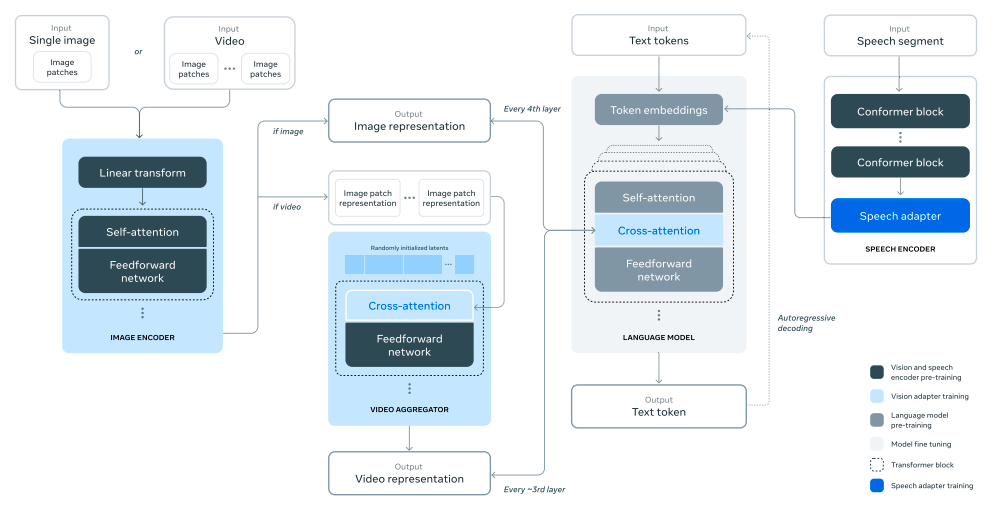
GAMA: A Large Audio-Language Model with Advanced Audio Understanding and Complex Reasoning Abilities|[GAMA](https://sreyan88.github.io/gamaaudio/)|Audio Spectrogram Transformer (AST)|LLaMa2-13B|Integating three types of speech feature, namely, soft prompt with audio information, Q-former feature, multi-level from the codec extractor. Syhthsize the data with different audio tasks, such audio caption and audio event. |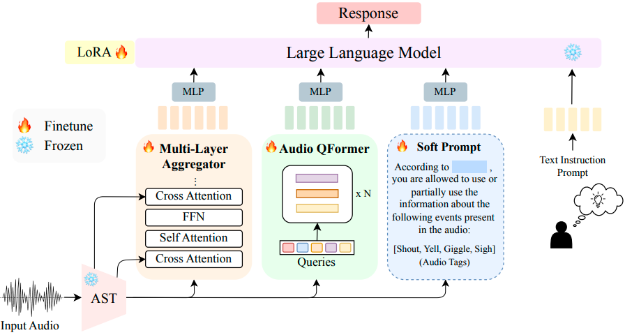
AudioChatLlama: Towards General-Purpose Speech Abilities for LLMs|[AudioChatLLaMA](https://arxiv.org/pdf/2311.06753)|Conformer pretrained with CTC |Llama-2-chat (7B) | Applying modal-invariance trick, whether the text or speech with same meaning, the LLM should respone similarly. Thus they apply the chat-style prompt to tune the model. The user prompt is transcrpition and system prompt is empty. |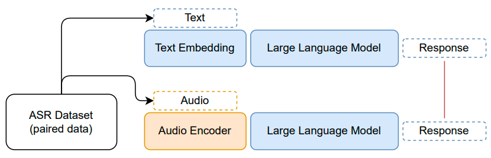
JOINT AUDIO AND SPEECH UNDERSTANDING | [LTU-AS](https://github.com/yuangongnd/ltu) | Wishper | LLaMA | For speech processing, they apply a Whisper encoder to obtain the logits, followed by a projection layer to convert them to text-level tokens. The next tokens are generated by the Whisper decoder. By adding the corresponding instructions and a LoRA adapter, they created decoder-only speech LLMs based on LLaMA. |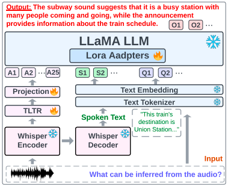 
LISTEN, THINK, AND UNDERSTAND | [LTU](https://github.com/yuangongnd/ltu) |  Audio Spectrogram Transformer | LLaMA |The training strategy is similar to LTU-AS but uses a speech encoder. Thus, the training data consists only of audio-text pairs. | 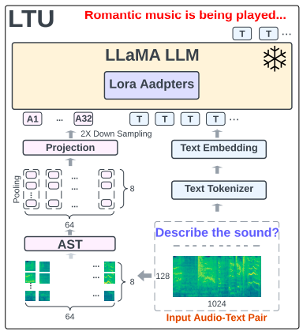
Qwen-Audio: Advancing Universal Audio Understanding via Unified Large-Scale Audio-Language Models| Qwen-Audio | Whisper encoder | Qwen-7B| This work applies the Whisper-style format to tag the audio and then requires the Qwen model to predict the tag message, including task, timestamp, language, transcription, and so on. | 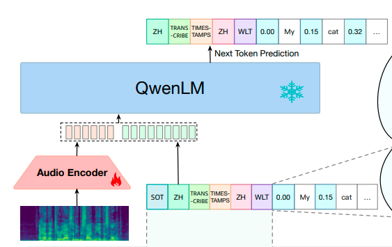
Qwen2-Audio Technical Report|[Qwen2-Audio](https://github.com/QwenLM/Qwen2-Audio) |Wishper|Qwen-7B|More speech and audio data, DOP to learn the human preferences.|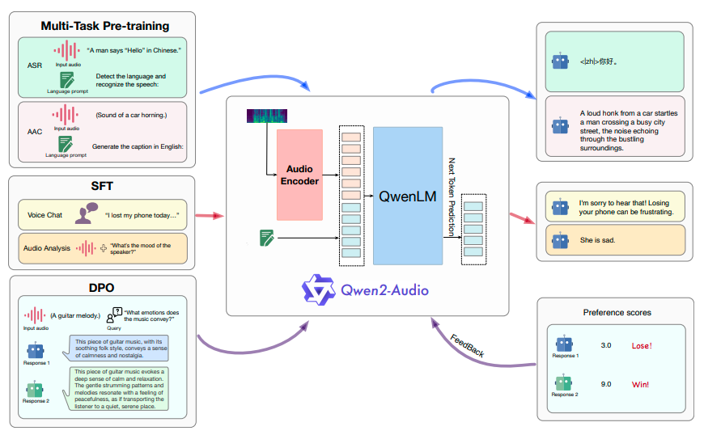
SALMONN: TOWARDS GENERIC HEARING ABILITIES FOR LARGE LANGUAGE MODELS | [SALMONN](https://github.com/bytedance/SALMONN) |  Wishper encoder (speech) & BEATs encoder (Audio) | Vicuna | To process the audio, this work applies two speech encoders to model speech and audio separately. The two features are stacked and processed by a Window-level Q-former. This method designs a fixed feature space and compresses information from the window-size speech feature into this space. The features produced by the Q-former can be viewed as speech tokens. After proper instruction tuning with a LoRA adapter, the LLMs can process both speech and sound.| 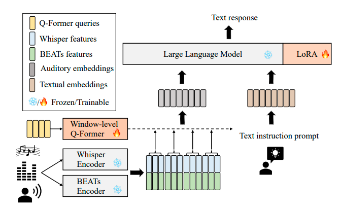
Audio Flamingo: A Novel Audio Language Model with Few-Shot Learning and Dialogue Abilities |[Audio Flamingo](https://github.com/NVIDIA/audio-flamingo)| ClapCap (Audio feature) |OPT-IML-MAX-1.3B|Strong audio understanding benefits from in-context learning and multi-turn dialogue. It uses a cross-attention and gated network to fuse audio information into LLMs. | 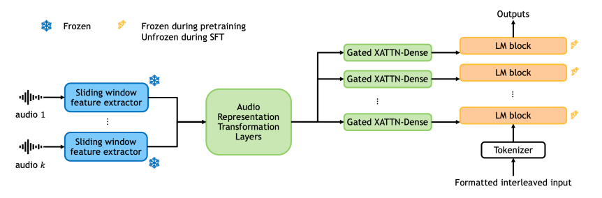
UnIVAL: Unified Model for Image, Video, Audio and Language Tasks | [UnIVAL](https://github.com/mshukor/UnIVAL) | Modality-specific encoder(ResNet-101 for image, 3D ResNext-101 for video, PANN for audio) | BART-base | A mid-sized model (~0.25B) is used to process all types of modalities, but it requires fine-tuning for downstream tasks. To improve training efficiency, they use high-quality data to avoid massive datasets and design a multimodal curriculum learning approach. | 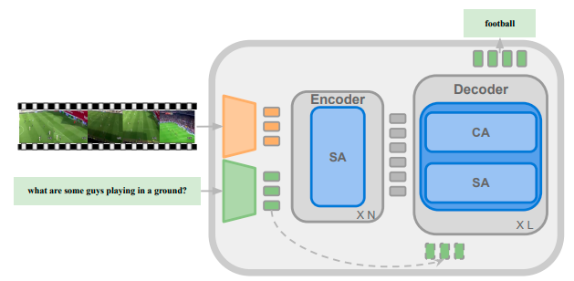
LLASM: LARGE LANGUAGE AND SPEECH MODEL |[Llasm](https://github.com/LinkSoul-AI/LLaSM)| Wishper encoder | Chinese-LLaMA2-7B |The method is similar to LLaVA. Modal adapters bridge the gap between speech features and word embeddings. In the pretraining stage, only the adapters are adjusted, followed by instruction tuning via multi-task learning. During the fine-tuning stage, the LLMs and adapters are updated, primarily using a multi-turn QA dataset. | 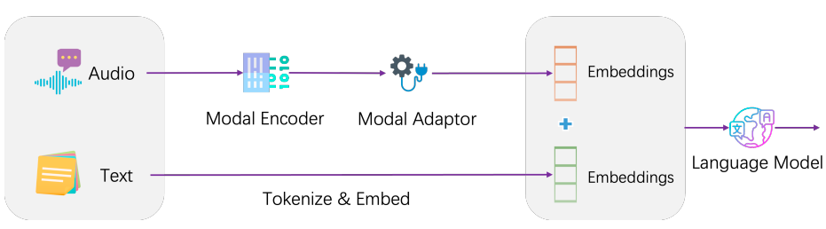
Video-LLaMA: An Instruction-tuned Audio-Visual Language Model for Video Understanding|[Video-LLaMA](https://github.com/DAMO-NLP-SG/Video-LLaMA)| Imagebind| LLaMA or Vicuna |Q-former and ImageBind are applied to extract temporal change information and audio-visual signals. The LLM and modality extractor are kept frozen.| 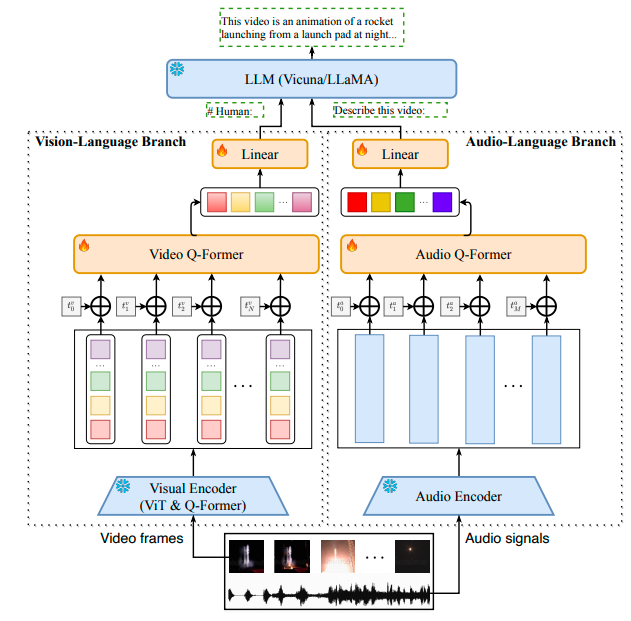
MACAW-LLM: MULTI-MODAL LANGUAGE MODELING WITH IMAGE, AUDIO, VIDEO, AND TEXT INTEGRATION |[MACAW-LLM](https://github.com/lyuchenyang/Macaw-LLM)| CLIP(Image), Wishper encoder(Audio)|LLaMA-7B |The aim is to integrate four modality features (image, video, audio, and text) into LLMs. They apply Conv1D to adjust the length of different modality features. Then, they use cross-attention to align speech and image features with word embeddings. Instead of applying a pretraining stage, they proceed directly to instruction tuning. |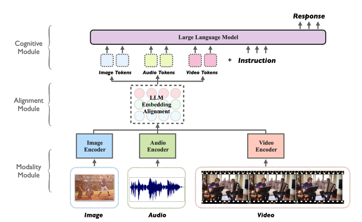
LauraGPT: Listen, Attend, Understand, and Regenerate Audio with GPT | [Lauragpt](https://lauragpt.github.io/)| Conformer encoder and improved EnCodec | Qwen-1.8B | They apply continuous features as input and discrete features (codec) as output. They simplify the synthesis process by converting codec tokens to audio using a single vocoder. | 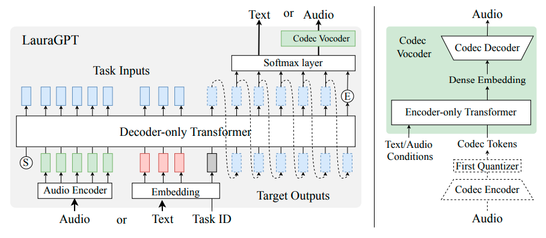
MUSIC UNDERSTANDING LLAMA: ADVANCING TEXT-TO-MUSIC GENERATION WITH QUESTION ANSWERING AND CAPTIONING |[MU-LLaMA](https://github.com/shansongliu/MU-LLaMA)|MERT encoder| LLaMA| They use MERT to convert MUSIC into features, followed by an adapter. The adapter's output serves as the query for attention in the last layer of the LLM. The training process updates only the adapter parameters.|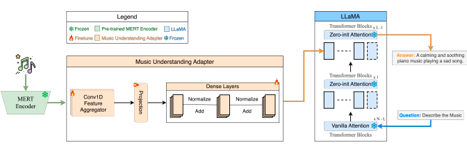
Pengi: An Audio Language Model for Audio Tasks |[Pengi](https://github.com/microsoft/Pengi)|CLAP, a frozen encoder to model text prompt |GPT2-base | They apply two encoders to process the audio and text separately. Then, two mapping networks convert the features to fixed lengths. Both the CLAP and mapping networks are updated. |
SLM: BRIDGE THE THIN GAP BETWEEN SPEECH AND TEXT FOUNDATION MODELS |[SLM](https://arxiv.org/pdf/2310.00230)| Encoder of USM | T5-13B(mT0-MT XXL) | Efficient tuning only updates the adapter to bridge the gap between the speech encoder and LLMs. |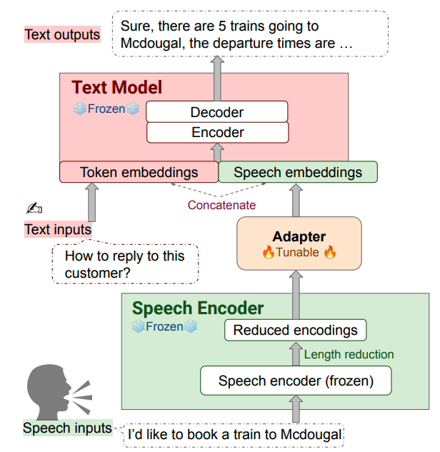
COSMIC: Data Efficient Instruction-tuning For Speech In-Context Learning|[COSMIC](https://arxiv.org/pdf/2311.02248)|Whisper encoder |LLaMA-2|Improve the in-context learning ability by concatenating different samples as instructions to tune the model. The speech samples are converted to features using the Q-former method.|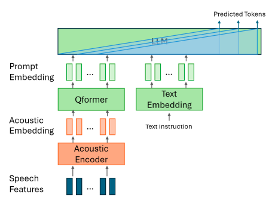
NExT-GPT: Any-to-Any Multimodal LLM|[NeXT-gpt](https://next-gpt.github.io/)|Imagebind | Vicuna-7B| To make the LLMs understand all modalities (text, image, video, and audio), they use modal concept tokens to guide the LLMs in processing extracted features. They apply modality-switching instruction tuning to achieve text-to-other-modality generation.| 
AnyGPT: Unified Multimodal LLM with Discrete Sequence Modeling|[Anygpt](https://junzhan2000.github.io/AnyGPT.github.io/)|SpeechTokenizer  (VQ-VAE) for speech, SEED (ViT+Q-former) for image,  Encodec for music |LLaMA-2 (7B)| To enable LLMs to process speech, text, images, and music, they designed a strategy to build AnyInstruct-108k, a multi-modal, multi-turn dataset. The data production pipeline is as follows: 1. Obtain text about the topic, 2. Generate more details about the scenarios, 3. Describe more chat information to inject the multi-modal data, 4. Synthesize the other modal data. The first three steps are completed with the help of GPT-4. They use DALLE-3, MusicGen, and Microsoft Azure to produce images, music, and speech, respectively. |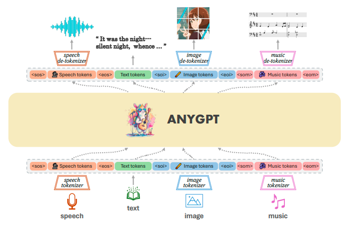
AudioPaLM: A Large Language Model That Can Speak and Listen|[AudioPalm](https://google-research.github.io/seanet/audiopalm/examples/)|SoundStream|PaLM|Simply convert the speech to a codec and apply auto-regressive training to the concatenated text and codec. |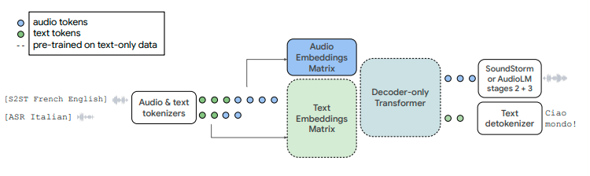
SpeechGPT: Empowering Large Language Models with Intrinsic Cross-Modal Conversational Abilities|[SpeechGPT](https://github.com/0nutation/SpeechGPT)| HuBERT | LLaMA| Convert the speech to unit tokens, then use auto-regressive pretraining similar to text to build the speech LLMs. |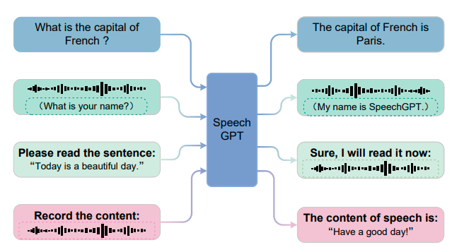
AudioGPT: Understanding and Generating Speech, Music, Sound, and Talking Head|[AudioGPT](https://github.com/AIGC-Audio/AudioGPT)| A series of models |gpt-3.5-turbo | A set of different models, including LLMs, is used to process audio tasks. The process consists of four steps: 1) Modality transformation, 2) Task analysis, 3) Model assignment, and 4) Response generation. |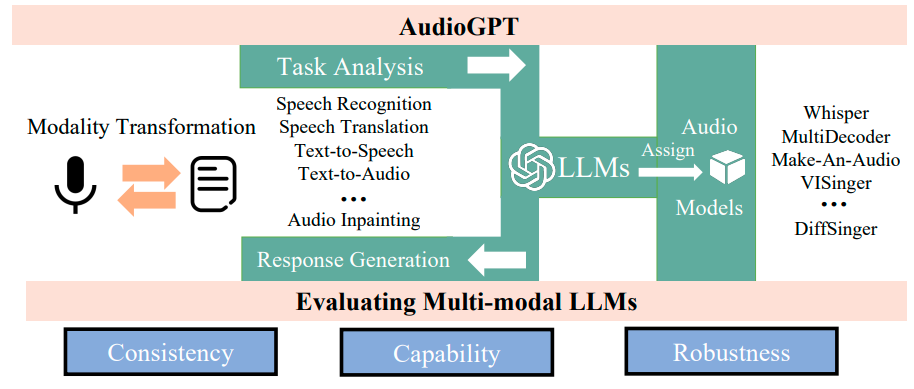
Seed-ASR: Understanding Diverse Speech and Contexts with LLM-based Speech Recognition|[SEED-ASR](https://arxiv.org/html/2407.04675v1)|LUISE (seems an improved HuBERT) |-|Focus on multi-lingual close-ended speech tasks, such as ASR and ST. |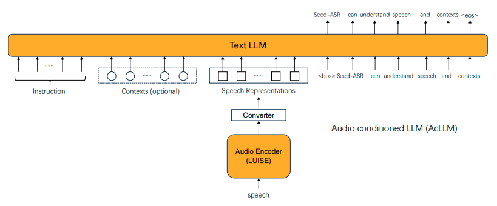
WavLLM: Towards Robust and Adaptive Speech Large Language Model|wavLLM|Whisper encoder and WavLM | LLaMA-2-7B-chat| They apply two audio encoders to extract textual and acoustic features separately. There are three adapters for the semantic, acoustic, and prompt modules. All parts except the LoRA are frozen during the training process. For curriculum learning, they first train on single tasks, then proceed to multi-task training to prevent the LLM from overfitting on specific speech tasks. |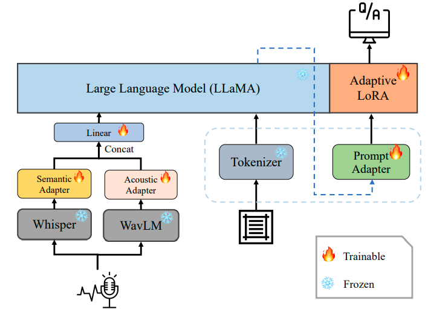
SPIRIT-LM: Interleaved Spoken and Written Language Model|[SPIRIT-LM](https://speechbot.github.io/spiritlm)| HuBERT for semantic token, VQ-VAE for pitch token, SONAR for style token |LLaMA-2-7B|Mix the speech and text tokens to achieve modality alignment, with additional style and pitch tokens extracted from the speech.| 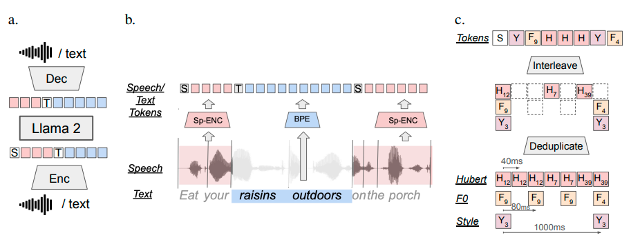
ON DECODER-ONLY ARCHITECTURE FOR SPEECH-TO-TEXT AND LARGE LANGUAGE MODEL INTEGRATION|[Speech LLaMA](https://arxiv.org/pdf/2307.03917)| Wishper encoder|LLaMA-7B|Apply a CTC to compress the speech sequence, followed by an audio encoder that is a 4-layer Transformer. The training is auto-regressive based on LoRA.| 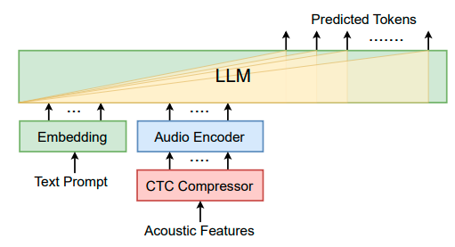
SpeechVerse: A Large-scale Generalizable Audio Language Model | [SpeechVerse](https://arxiv.org/pdf/2405.08295)| WavLM-Large|Flan-T5-XL|They sample instructions to balance different tasks and apply curriculum learning to improve training efficiency. The model supports open-ended tasks rather than specific tasks.|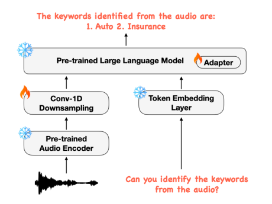
VOXTLM: UNIFIED DECODER-ONLY MODELS FOR CONSOLIDATING SPEECH RECOGNITION, SYNTHESIS AND SPEECH, TEXT CONTINUATION TASKS|[VOXTLM](https://soumimaiti.github.io/icassp24_voxtlm/)|HuBERT|OPT|A unified vocabulary is used for both speech codec and text tokens.|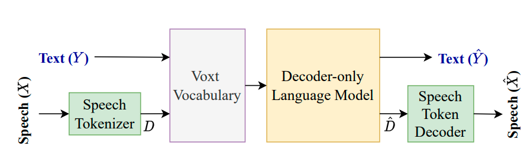

