# Speech LLMs Progress
A summarization of current Speech LLMs, the ranking of the following works is random.

 Paper | Name | Speech model | LLM | Dataset|prompt |Method | Architecture
-----|----|------|---|---|---|--|----|
The Llama 3 Herd of Models|[LLaMA 3](https://llama.meta.com/)|Conformer (BEST-RQ) |LLaMA 3|15M hours of speech(VQ), 230K hours ASR(34 languages),90k hours of translations(33 langauges to or from English),60k hours of synthesis dialogue data|Repeat after me in {language}:(ASR)   Translate the following sentence into {language}:(ST).|The first stage pretrains the speech encoder and the second stage tunes the encoder and adpater with frozen LLMs. | 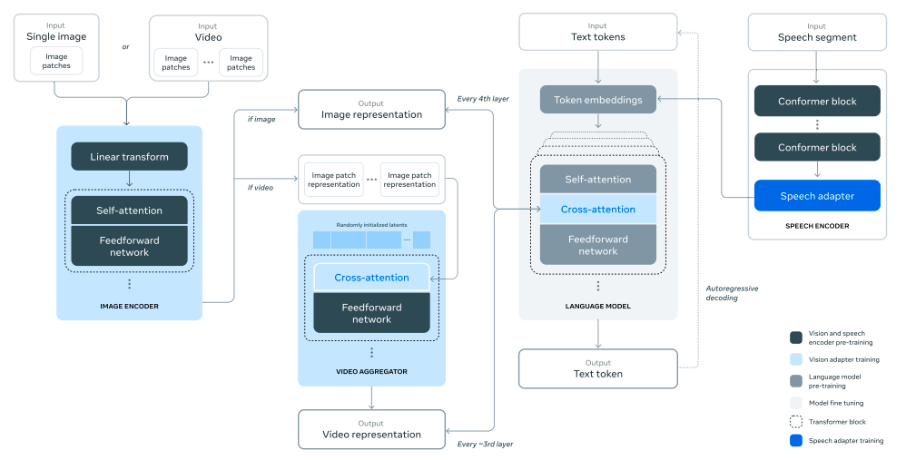
GAMA: A Large Audio-Language Model with Advanced Audio Understanding and Complex Reasoning Abilities|[GAMA](https://sreyan88.github.io/gamaaudio/)|Audio Spectrogram Transformer (AST)|LLaMa2-13B|OpenAQA(Extened)|VIT multi-turn tuning|Integating three types of speech feature, namely, soft prompt with audio information, Q-former feature, multi-level from the codec extractor. Syhthsize the data with different audio tasks, such audio caption and audio event. |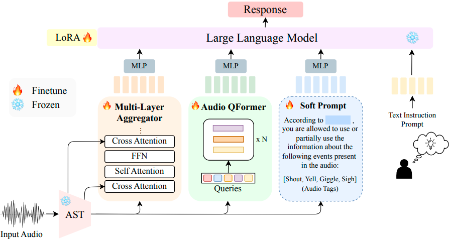
AudioChatLlama: Towards General-Purpose Speech Abilities for LLMs|[AudioChatLLaMA](https://arxiv.org/pdf/2311.06753)|Conformer pretrained with CTC |Llama-2-chat (7B) |Multilingual LibriSpeech(50K) ASR, |prompt = "\<s\>[INST] <\<SYS\>>\n{{system_prompt}}\n<\<\/SYS\>>\n\n{{user_prompt}} [/INST]"|Applying modal-invariance trick, whether the text or speech with same meaning, the LLM should respone similarly. Thus they apply the chat-style prompt to tune the model. The user prompt is transcrpition and system prompt is empty. |
JOINT AUDIO AND SPEECH UNDERSTANDING | [LTU-AS](https://github.com/yuangongnd/ltu) | Wishper | LLaMA |Open-ASQA|write an audio caption describing the sound.(Closed-ended) Below is a pair of question and response. Identify if the response directly answers the question and give a clear answer. (Open-ended)| For speech processing, they apply a Whisper encoder to obtain the logits, followed by a projection layer to convert them to text-level tokens. The next tokens are generated by the Whisper decoder. By adding the corresponding instructions and a LoRA adapter, they created decoder-only speech LLMs based on LLaMA. |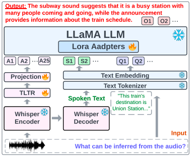 
LISTEN, THINK, AND UNDERSTAND | [LTU](https://github.com/yuangongnd/ltu) |  Audio Spectrogram Transformer | LLaMA |OpenAQA|"classify the sound events in the audio clip" and "write an audio caption describing the sound" for classification, "write an audio caption describing the sound" for audio caption.|The training strategy is similar to LTU-AS but uses a speech encoder. Thus, the training data consists only of audio-text pairs. | 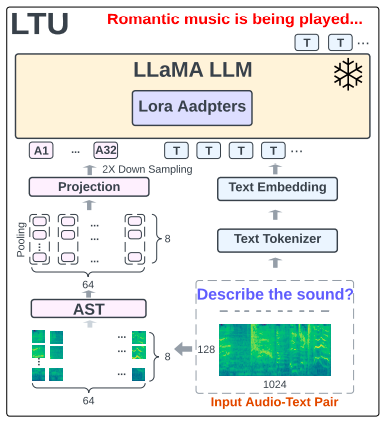
Qwen-Audio: Advancing Universal Audio Understanding via Unified Large-Scale Audio-Language Models| Qwen-Audio | Whisper encoder | Qwen-7B|ASR, ST, OSR, Dialect ASR, SRWT (English,Mandarin), DID, LID, SGC, ER, SV, SD, SER, KS, IC, SF, SAP, VSC   AAC, SEC, ASC, SED, AQA   SID, SMER, MC, MIC, MNA, MGR, MR, MQA |\<im_start\>user   Audio 1: \<audio\>emov-db/141-168-0155.wav\</audio\>what does the speaker say?\<im_end\>   \<im_start\>assistant   The speaker says in English, "Won’t you draw up, gentlemen.".\<im_end\>   \<im_start\>user   What’s the mood of the person?\<im_end\>   \<im_start\>assistant   Based on the voice, the mood of the person is disgusted.\<im_end\> |This work applies the Whisper-style format to tag the audio and then requires the Qwen model to predict the tag message, including task, timestamp, language, transcription, and so on. | 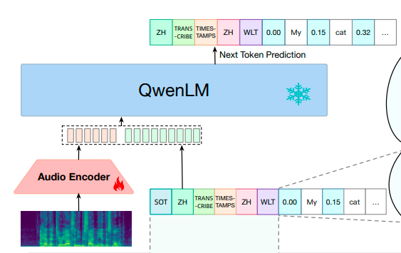
Qwen2-Audio Technical Report|[Qwen2-Audio](https://github.com/QwenLM/Qwen2-Audio) |Wishper|Qwen-7B|370k hours speech, 10k sound, 140k music|Natural language prompts|More speech and audio data, DOP to learn the human preferences.|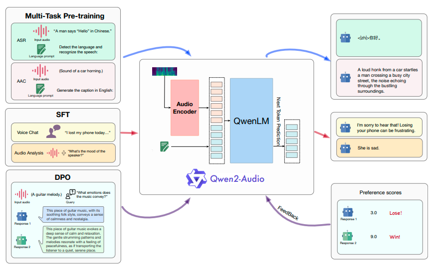
SALMONN: TOWARDS GENERIC HEARING ABILITIES FOR LARGE LANGUAGE MODELS | [SALMONN](https://github.com/bytedance/SALMONN) |  Wishper encoder (speech) & BEATs encoder (Audio) | Vicuna |Librispeech, GigaSpeech (ASR)   WavCaps, AudioCaps (Sound)   Clotho (caption) for pretraining, 4400 hours for instruction tuning. | USER: [Auditory Tokens] Text Prompt \n ASSISTANT: |To process the audio, this work applies two speech encoders to model speech and audio separately. The two features are stacked and processed by a Window-level Q-former. This method designs a fixed feature space and compresses information from the window-size speech feature into this space. The features produced by the Q-former can be viewed as speech tokens. After proper instruction tuning with a LoRA adapter, the LLMs can process both speech and sound.| 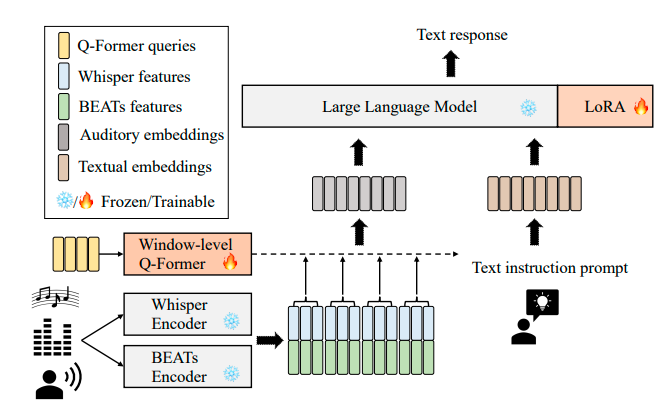
Audio Flamingo: A Novel Audio Language Model with Few-Shot Learning and Dialogue Abilities |[Audio Flamingo](https://github.com/NVIDIA/audio-flamingo)| ClapCap (Audio feature) |OPT-IML-MAX-1.3B|AAC AQA SEC|Based on the sound events, create a dialogue between you (the assistant) and a person (the user) about the events in the audio. Each dialogue should consist of: 1. A user examines the audio, and sends a reasonable and creative message to the assistant. 2. Once the audio is provided, the assistant thoroughly perceives and comprehends them, responding with helpful answers that provide comprehensive reasoning. Do not include timestamps in the answer provided by the assistant. 3. Considering the past dialogue i.e. the question and the answer in the previous timestep, the user chooses another question or further inquiry. 4. The assistant provides a helpful answer providing comprehensive reasoning regarding the audiocontent. The audios are 10 seconds long and the sound events are segmented based on where they occur in the audio. All the questions asked by the user should be diverse and complex. |Strong audio understanding benefits from in-context learning and multi-turn dialogue. It uses a cross-attention and gated network to fuse audio information into LLMs. | 
UnIVAL: Unified Model for Image, Video, Audio and Language Tasks | [UnIVAL](https://github.com/mshukor/UnIVAL) | Modality-specific encoder(ResNet-101 for image, 3D ResNext-101 for video, PANN for audio) | BART-base |LAVENDER(video caption). |textual prompt resembling an instruction| A mid-sized model (~0.25B) is used to process all types of modalities, but it requires fine-tuning for downstream tasks. To improve training efficiency, they use high-quality data to avoid massive datasets and design a multimodal curriculum learning approach. | 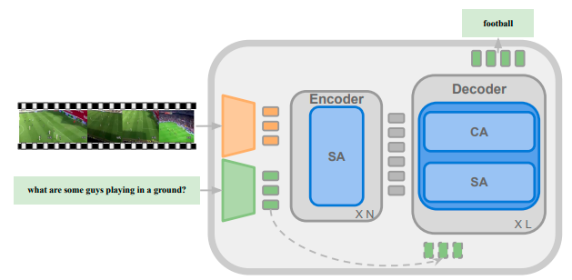
LLASM: LARGE LANGUAGE AND SPEECH MODEL |[Llasm](https://github.com/LinkSoul-AI/LLaSM)| Wishper encoder | Chinese-LLaMA2-7B |Aishell, LibriSpeech, Magicdata and Primewords (ASR)   WizardLM, ShareGPT (Dialog) |$X_{sample}$ = B_INST + B_SYS + SYSTEM + E_SYS + {$content_{user}$} + E_INST + {$content_{gpt}$}   $content_{user}$ = {$audio_{token}$} + "\n" + $I_{simple}$ (or $content_{user} = I_{simple}$ + "\n" +{$audio_{token}$})   $content_{gpt}$ = TEXT_LABEL   $audio_{token}$ = AUDIO_STATRT_TOKEN + AUDIO_PATCH_TOKEN * {audio_token_len} + AUDIO_END_TOKEN   The SYSTEM = ’You are a helpful language and speech assistant. You are able to understand the speech content that the user provides, and assist the user with a variety of tasks using natural language.’|The method is similar to LLaVA. Modal adapters bridge the gap between speech features and word embeddings. In the pretraining stage, only the adapters are adjusted, followed by instruction tuning via multi-task learning. During the fine-tuning stage, the LLMs and adapters are updated, primarily using a multi-turn QA dataset. | 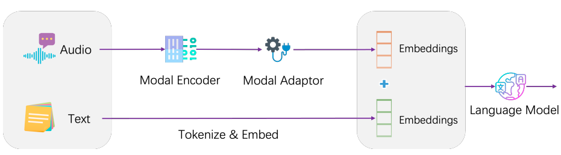
Video-LLaMA: An Instruction-tuned Audio-Visual Language Model for Video Understanding|[Video-LLaMA](https://github.com/DAMO-NLP-SG/Video-LLaMA)| Imagebind| LLaMA or Vicuna | Webvid-2M (Video caption)|Describe this video:(caption) |Q-former and ImageBind are applied to extract temporal change information and audio-visual signals. The LLM and modality extractor are kept frozen.| 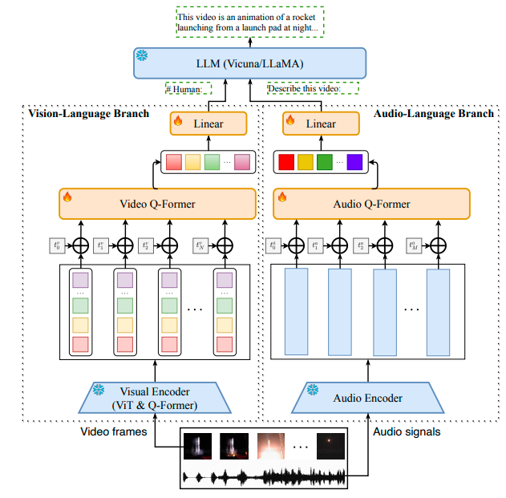
MACAW-LLM: MULTI-MODAL LANGUAGE MODELING WITH IMAGE, AUDIO, VIDEO, AND TEXT INTEGRATION |[MACAW-LLM](https://github.com/lyuchenyang/Macaw-LLM)| CLIP(Image), Wishper encoder(Audio)|LLaMA-7B |Charades,AVSD(Video caption)|This is the caption of an image/video: {. . . }. This image/video contains important information that needs to be conveyed through high-quality instructions. Your task is to provide ten pairs of instructions and responses that are related to the content of the image/video caption like dialogue concentrating on the content of the image/video without explicitly mentioning the caption or the word ’caption’. Your focus should be on describing, explaining, or analyzing various aspects of the image/video, as well as providing some QA pairs. The purpose of this exercise is to fine-tune a language model so that it can generate accurate and relevant responses. In each pair, the first line should start with "Q:" and contain an instruction related to the image/video, while the second line should start with "A:" and provide a response to the instruction. Please ensure that your instructions are diverse and of high quality, accurately reflecting the content of the image and providing useful information to the language model:|The aim is to integrate four modality features (image, video, audio, and text) into LLMs. They apply Conv1D to adjust the length of different modality features. Then, they use cross-attention to align speech and image features with word embeddings. Instead of applying a pretraining stage, they proceed directly to instruction tuning. |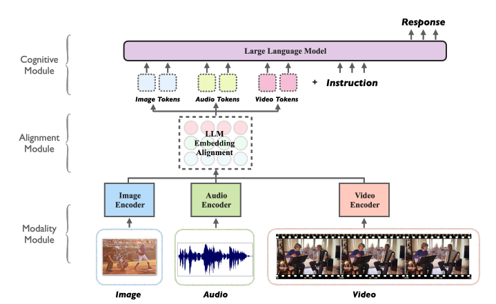
LauraGPT: Listen, Attend, Understand, and Regenerate Audio with GPT | [Lauragpt](https://lauragpt.github.io/)| Conformer encoder and improved EnCodec | Qwen-1.8B |AISHELL-1, AISHELL-2, Wenet-Speech, LibriSpeech, GigaSpeech (ASR)  BSTC, CoVOST 2, ParaCrawl v9 dataset (ST)   MELD, IEMOCAP, RAVDESS, TESS, Crema-D, Emov-DB, SAVEE (SER)   SLURP (SLU), AudioCaps, WavCaps (AAC) FSD-50K (SE)  | Task label| They apply continuous features as input and discrete features (codec) as output. They simplify the synthesis process by converting codec tokens to audio using a single vocoder. | 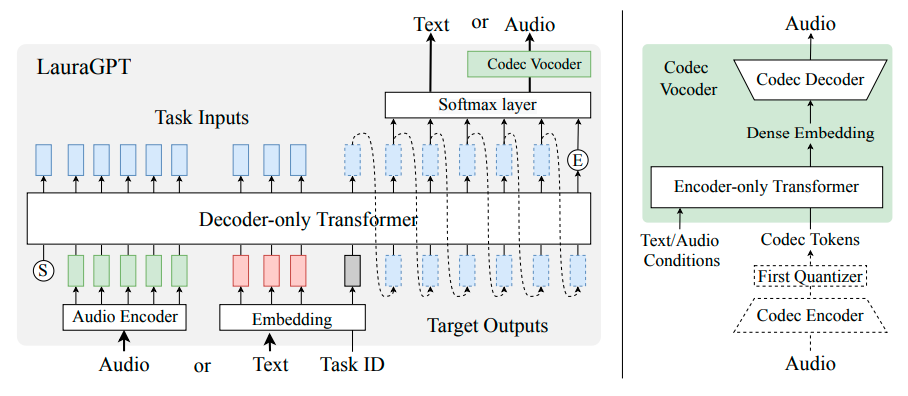
MUSIC UNDERSTANDING LLAMA: ADVANCING TEXT-TO-MUSIC GENERATION WITH QUESTION ANSWERING AND CAPTIONING |[MU-LLaMA](https://github.com/shansongliu/MU-LLaMA)|MERT encoder| LLaMA| MusicCaps, MagnaTagATune (Music description)|Describe the Music.| They use MERT to convert MUSIC into features, followed by an adapter. The adapter's output serves as the query for attention in the last layer of the LLM. The training process updates only the adapter parameters.|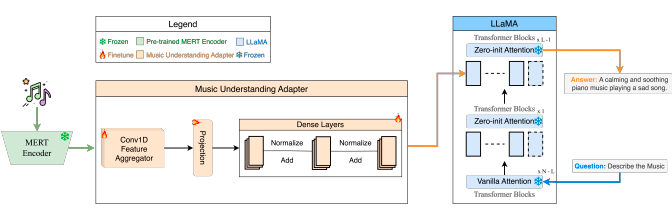
Pengi: An Audio Language Model for Audio Tasks |[Pengi](https://github.com/microsoft/Pengi)|CLAP, a frozen encoder to model text prompt |GPT2-base |SEC: AudioSet, FSD50K; ASC: CochlScene; ER: MSP Podcast, CMU MOSI, CMU MOSEI, MELD; MC: NSynth, FMA; AAC: AudioCaps, ClothoV2; AQA: ClothoAQA; Auxiliary: WavText5K, SoundDescs, MACS, WavCaps, FreeSound and FindSound|Audio Captioning: generate audio caption {caption}   Audio QA: question {question} {answer}   Sound Event Classification: this is a sound of {event a}, {event b}, ..   Acoustic Scene Classification: this acoustic scene is {scene}   Speech Emotion Recognition: this emotion is {emotion}   Speech Sentiment Recognition: this sentiment is {sentiment}   Music Analysis: music analysis this is a sound of music in language {language} and genre {genre} ..   Music Note Analysis: this music note is produced by {instrument}, pitch {pitch}, ..   Auxiliary: generate metadata {metadata}|They apply two encoders to process the audio and text separately. Then, two mapping networks convert the features to fixed lengths. Both the CLAP and mapping networks are updated. |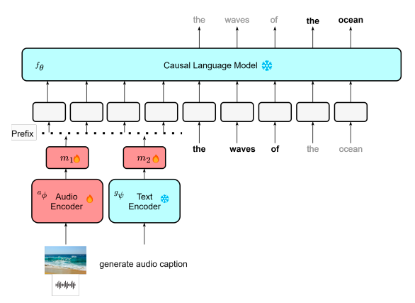
SLM: BRIDGE THE THIN GAP BETWEEN SPEECH AND TEXT FOUNDATION MODELS |[SLM](https://arxiv.org/pdf/2310.00230)| Encoder of USM | T5-13B(mT0-MT XXL) | Multi-lingual YouTube (ASR), CoVoST2 (ST), Alpaca (Instruction tuning) |Text from text instruction tuning |Efficient tuning only updates the adapter to bridge the gap between the speech encoder and LLMs. |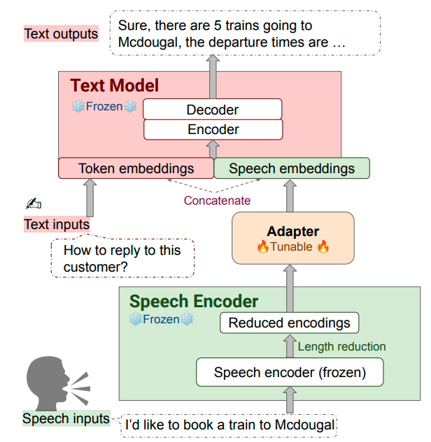
COSMIC: Data Efficient Instruction-tuning For Speech In-Context Learning|[COSMIC](https://arxiv.org/pdf/2311.02248)|Whisper encoder |LLaMA-2|TED-LIUM (ASR), Generated by GPT4 (SQA)| Text from text instruction tuning|Improve the in-context learning ability by concatenating different samples as instructions to tune the model. The speech samples are converted to features using the Q-former method.|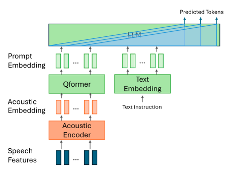
NExT-GPT: Any-to-Any Multimodal LLM|[NeXT-gpt](https://next-gpt.github.io/)|Imagebind | Vicuna-7B| Webvid-2M(video caption),AudioCaps(audio caption), CC3M(image caption)|"x-to-text" (multimedia caption task)|To make the LLMs understand all modalities (text, image, video, and audio), they use modal concept tokens to guide the LLMs in processing extracted features. They apply modality-switching instruction tuning to achieve text-to-other-modality generation.| 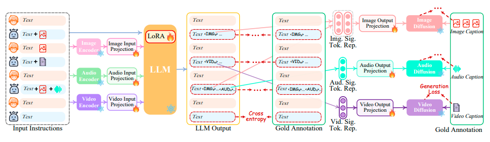
AnyGPT: Unified Multimodal LLM with Discrete Sequence Modeling|[Anygpt](https://junzhan2000.github.io/AnyGPT.github.io/)|SpeechTokenizer  (VQ-VAE) for speech, SEED (ViT+Q-former) for image,  Encodec for music |LLaMA-2 (7B)|Gigaspeech, Common Voice, and Multilingual LibriSpeech(English ASR), crawling over one million music videos(Music)|[Human]: {I}.{S}\<eoh\>. [AnyGPT]: {T}\<eos\>. or its variant [Human]: {I}. This is input:{T}\<eoh\>. [AnyGPT]: {S}\<eos\>., depending on the generation direction. |To enable LLMs to process speech, text, images, and music, they designed a strategy to build AnyInstruct-108k, a multi-modal, multi-turn dataset. The data production pipeline is as follows: 1. Obtain text about the topic, 2. Generate more details about the scenarios, 3. Describe more chat information to inject the multi-modal data, 4. Synthesize the other modal data. The first three steps are completed with the help of GPT-4. They use DALLE-3, MusicGen, and Microsoft Azure to produce images, music, and speech, respectively. |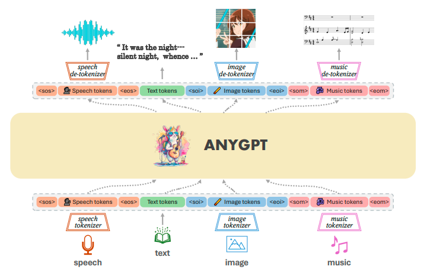
AudioPaLM: A Large Language Model That Can Speak and Listen|[AudioPalm](https://google-research.github.io/seanet/audiopalm/examples/)|SoundStream|PaLM|CoVoST2, VoxPopuli, CommonVoice, Conversational EsEn, YouTube ASR,  WMT/TED TTS, PaLM MT TTS (ASR, ST)|Task label|Simply convert the speech to a codec and apply auto-regressive training to the concatenated text and codec. |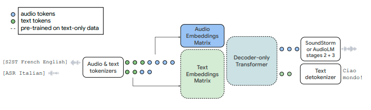
SpeechGPT: Empowering Large Language Models with Intrinsic Cross-Modal Conversational Abilities|[SpeechGPT](https://github.com/0nutation/SpeechGPT)| HuBERT | LLaMA| LibriLight (Audio SSL)，Gigaspeech,Common voice, LibriSpeech, moss-002-sft-data (SFT)|[Human]:{D}. This is input: {U}\<eoh\>.[SpeechGPT]: {T}\<eos\>.|Convert the speech to unit tokens, then use auto-regressive pretraining similar to text to build the speech LLMs. |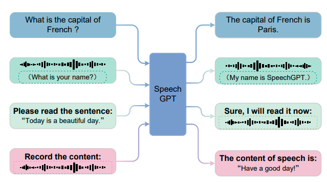
AudioGPT: Understanding and Generating Speech, Music, Sound, and Talking Head|[AudioGPT](https://github.com/AIGC-Audio/AudioGPT)| A series of models |gpt-3.5-turbo | -| -|A set of different models, including LLMs, is used to process audio tasks. The process consists of four steps: 1) Modality transformation, 2) Task analysis, 3) Model assignment, and 4) Response generation. |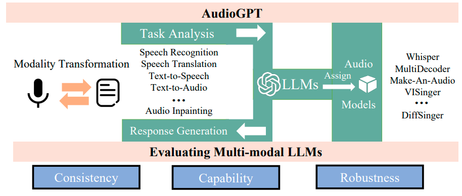
Seed-ASR: Understanding Diverse Speech and Contexts with LLM-based Speech Recognition|[SEED-ASR](https://arxiv.org/html/2407.04675v1)|LUISE (seems an improved HuBERT) |-|7.7m hours (audio SSL), 562k hours (SFT)|"There are relevant contexts, transcribe the speech into text:" or "Transcribe the speech into text:".|Focus on multi-lingual close-ended speech tasks, such as ASR and ST. |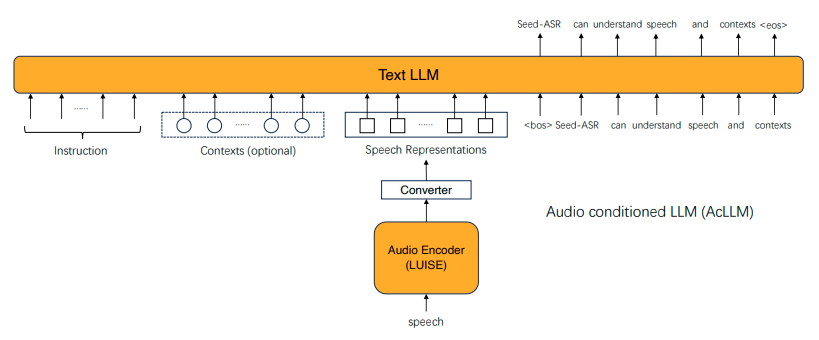
WavLLM: Towards Robust and Adaptive Speech Large Language Model|wavLLM|Whisper encoder and WavLM | LLaMA-2-7B-chat|LibriSpeech, LibriHeavy medium, CoVoST2, MuST-C, VoxCeleb，IEMOCAP Session, AMI, Fisher, Switchboard, Alpaca | \<bos\>[INST]«SYS»\n As a helpful language and speech assistant, you are able to understand the speech content provided by the user, and assist the user with a variety of tasks using natural language. \n«/SYS»\n\n \<SPEECH\>“ speech ” \<\/SPEECH\>“instruction” [/INST]“ target ”\<eos\> |They apply two audio encoders to extract textual and acoustic features separately. There are three adapters for the semantic, acoustic, and prompt modules. All parts except the LoRA are frozen during the training process. For curriculum learning, they first train on single tasks, then proceed to multi-task training to prevent the LLM from overfitting on specific speech tasks. |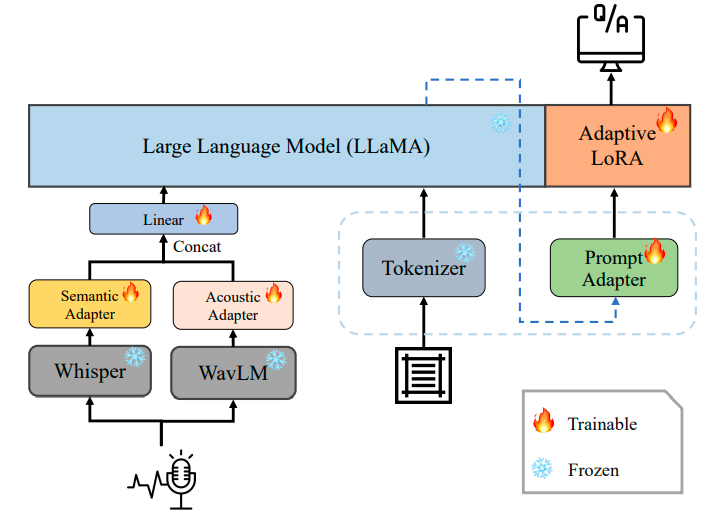
SPIRIT-LM: Interleaved Spoken and Written Language Model|[SPIRIT-LM](https://speechbot.github.io/spiritlm)| HuBERT for semantic token, VQ-VAE for pitch token, SONAR for style token |LLaMA-2-7B|Multilingual LibriSpeech, Vox Populi, Common Voice, Spotify and Fisher| S2S [SPEECH][Hubert tokens]..[Hubert tokens]   T2S [TEXT]The largest country in the world is [SPEECH][Hubert tokens]   S2T [SPEECH][Hubert tokens] [TEXT] 6 7 8 9 10...|Mix the speech and text tokens to achieve modality alignment, with additional style and pitch tokens extracted from the speech.| 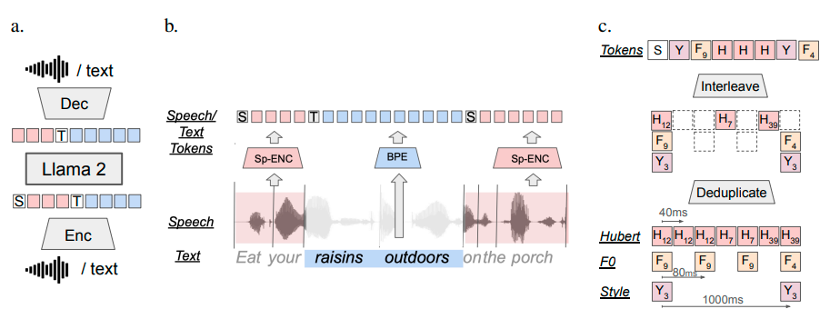
ON DECODER-ONLY ARCHITECTURE FOR SPEECH-TO-TEXT AND LARGE LANGUAGE MODEL INTEGRATION|[Speech LLaMA](https://arxiv.org/pdf/2307.03917)| Wishper encoder|LLaMA-7B|14K hours of multilingual in-house speech|transcribe the audio into Englis, translate [source] audio into English |Apply a CTC to compress the speech sequence, followed by an audio encoder that is a 4-layer Transformer. The training is auto-regressive based on LoRA.| 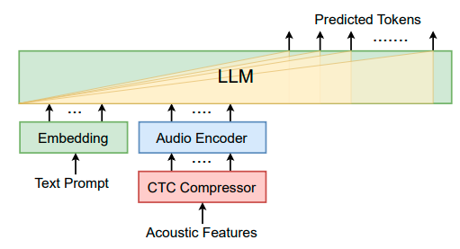
SpeechVerse: A Large-scale Generalizable Audio Language Model | [SpeechVerse](https://arxiv.org/pdf/2405.08295)| WavLM-Large|Flan-T5-XL|Librispeech, Common Voice, VoxPopuli, SLURP, EuroParl, MSP-Podcast (ASR)   CoVost2, EuroParl (ST)   SLURP (IC,SF)|Transcribe the preceding audio, What is being said in the preceding audio? (ASR)   Translate the english audio to german, Generate french translation for the english audio (ST)   The previous audio needs to be mapped to exactly one of the following intents: datetime_query: user asks about date, time, schedules, ..., etc (IC)   Identify any of the following slots present in the speech: date: any reference to a date, month or day of the week; (SF)   Identify important keywords in the preceding recording (KWE)   Is the word ’radio’ used in the audio? (KWS)  Detect the primary emotion conveyed in this audio by the speaker’s tone - is it happiness, sadness, anger, or neutral? (ER)   Classify the sentiment of the speaker into one of the following -positivity, negativity, or neutrality (ASC)   Analyze the speaker voice and figure out their accent from one of American, Indian, Australian, Canadian or British. (AC)   How many distinct speakers are there in this audio clip. (SC)   Is their speech in the preceding audio or not? (SNS)   |They sample instructions to balance different tasks and apply curriculum learning to improve training efficiency. The model supports open-ended tasks rather than specific tasks.|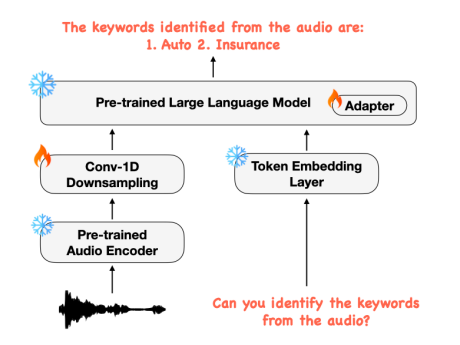
VOXTLM: UNIFIED DECODER-ONLY MODELS FOR CONSOLIDATING SPEECH RECOGNITION, SYNTHESIS AND SPEECH, TEXT CONTINUATION TASKS|[VOXTLM](https://soumimaiti.github.io/icassp24_voxtlm/)|HuBERT|OPT|LibriLight, Librispeech, English Multilingual Librispeech, LibriTTS, VCTK|T2T ⟨generate-text⟩, Y   S2S ⟨generate-speech⟩, D   S2T ⟨start-speech⟩, D, ⟨generate-text⟩, Y  T2S ⟨start-text⟩, Y, ⟨generate-speech⟩,D|A unified vocabulary is used for both speech codec and text tokens.|

||Task|
|---|---|
AAC|Automatic Audio Captioning
ABST|Audio-based Storytelling
AQA|Audio Question Answering
ASC|Acoustic Scene Classification
ASR|Automatic Speech Recognition
DASR|Automatic Dialect Speech Recognition
DID|Dialect Identification
ER|Emotion Recognition
GR|Gender Recognition
IC|Intent Classification
ITN|Inverse Text Normalization
KS|Keyword Spotting
LID|(spoken) Language Identification
MC|Music Captioning
MIC|Music Instruments Classification
MNA|Music Note Analysis (e.g. pitch, velocity)
MQA|Music Question Answering
MR|Music Recognition (including genre)
MT|Machine Translation
OSR|Overlapped Speech Recognition
PR|Phone Recognition
PT|Pronunciation Translation
SAP|Speaker Age Prediction
SD|Speaker Diarization
SEC|Sound Event Classification
SED|Sound Event Detection
SER|Speech Entity Recognition
SID|Singer Identification
SF|Slot Filling
SIT|Speech Instruction Tuning
SQA|Speech/Spoken Question Answering
SLU|Spoken Language Understanding
SRST|Speech Recognition with Sentence-level Timestamps
SRWT|Speech Recognition with Word-level Timestamps
ST|Speech Translation
STST|Speech Translation with Sentence-level Timestamps
SV|Speaker Verification
TE|Translation Explanation
VSC|Vocal Sound Classification

